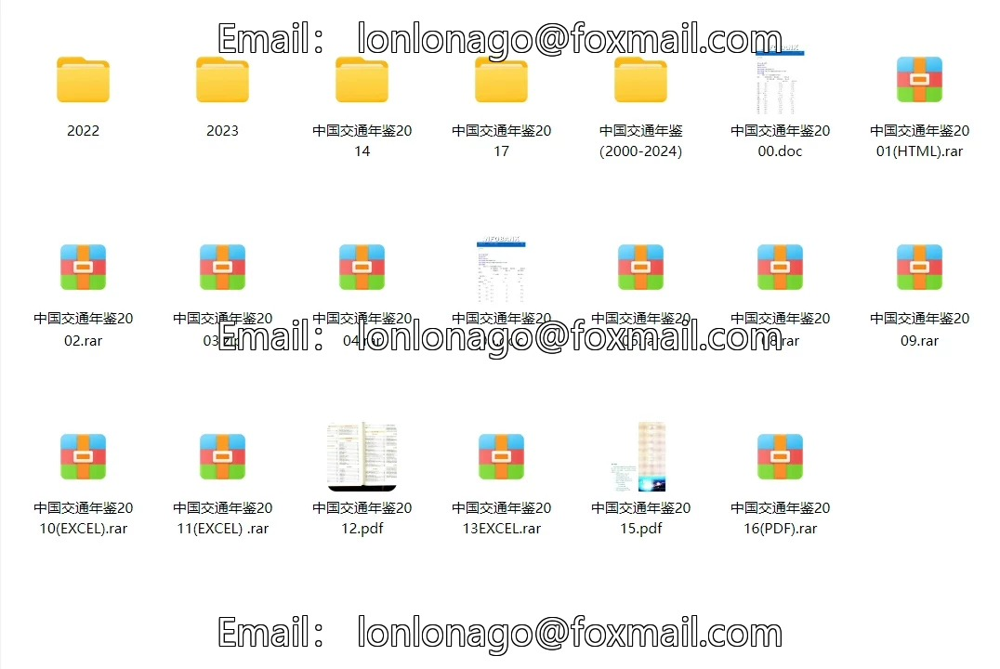
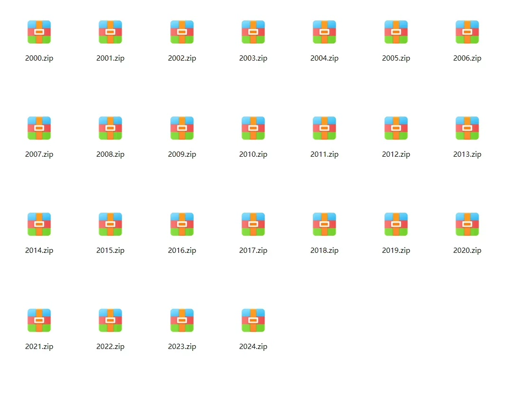
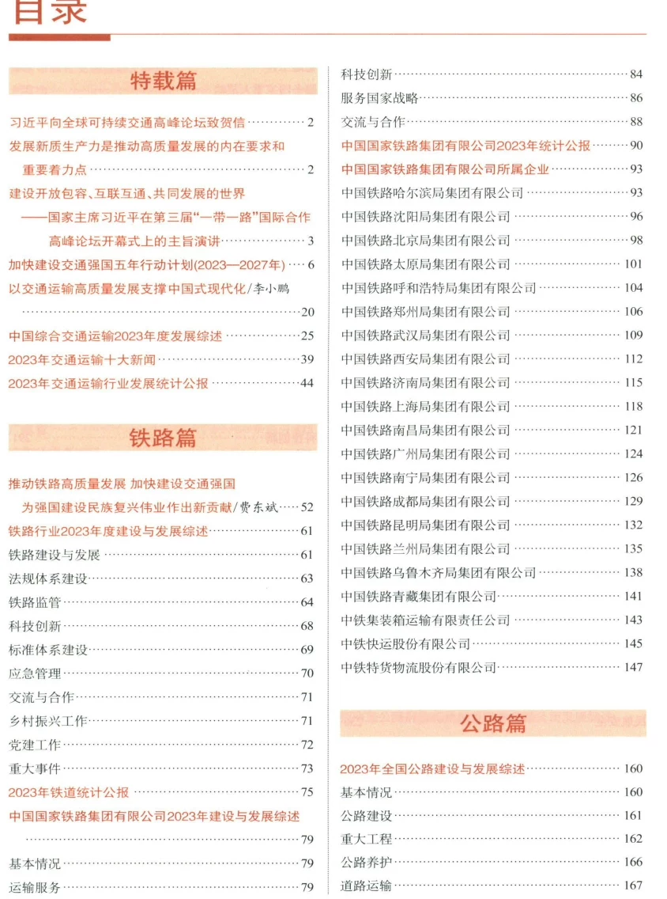
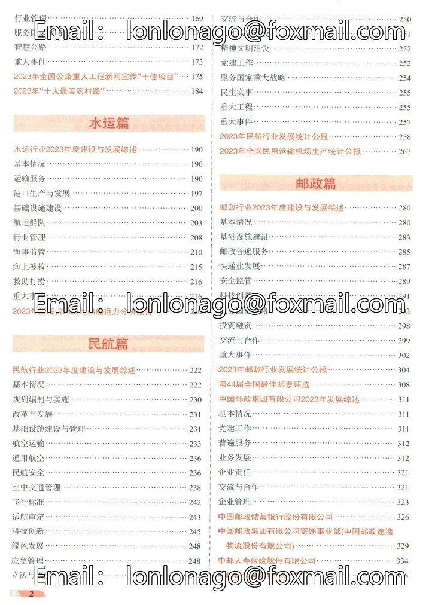
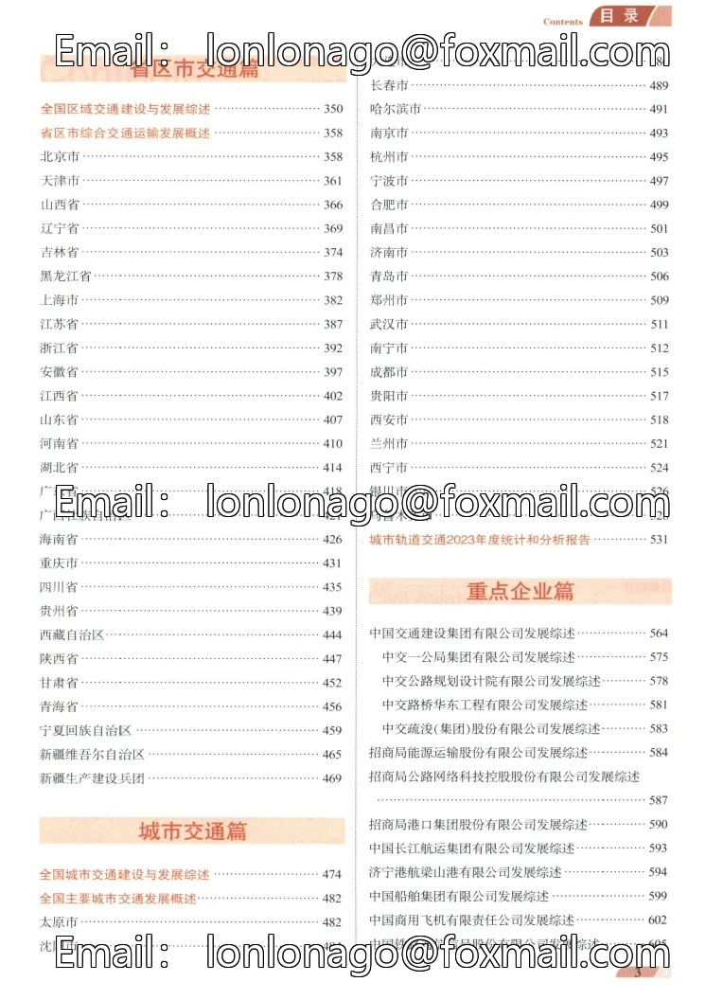
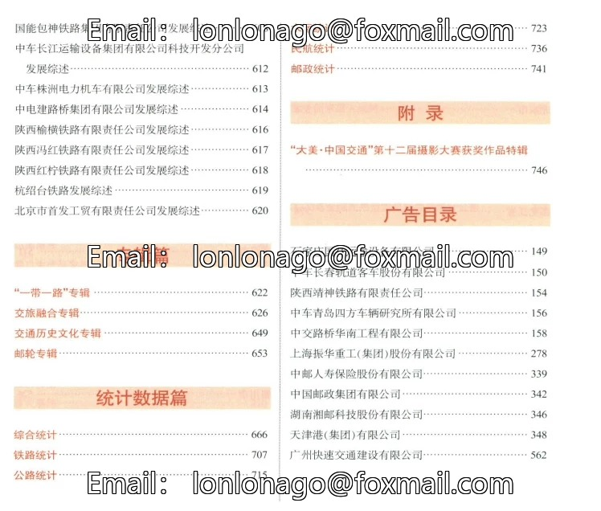

## Body

China Transportation Yearbook Data (2000-2024)

Year of the Yearbook: The yearbook covers the years from 2000 to 2024, with the data year being one less than the yearbook year.

01. Data Introduction
The China Transportation Yearbook is a continuous industry annual, systematically compiling the development of China's transportation industry. It includes important documents, policies and regulations, transportation sector development data, provincial transportation construction situations, etc., constructing an integrated information framework covering multiple fields such as highways, water transport, railways, civil aviation, etc.

02. Index Details
The directory is displayed in the picture, please take your time to view it on your own. If you need help finding specific data, feel free to contact us. We do not assist in finding data for you; all information is here. We do not support returns without reason.
The display directory is for the year 2024, with a vast amount of content. For some parts, you can use search engines to understand the content beforehand. The statistical methods may vary from year to year, and academic knowledge is expected to be understood.

03. Data Content
PDF and Excel versions are available, but only the PDF version is available for the year 2024. Some are zipped files that need to be downloaded and unzipped first. The file location is shown in the picture. Please read carefully before purchasing. If you have any objections, please do not purchase.

## Images

Here is a pay link on Stripe ( https://buy.stripe.com/3cs8yP7sY87d0vu9AB ). Please contact me lonlonago@foxmail.com after funding $89, and I will send you a complete data files , thank you!

